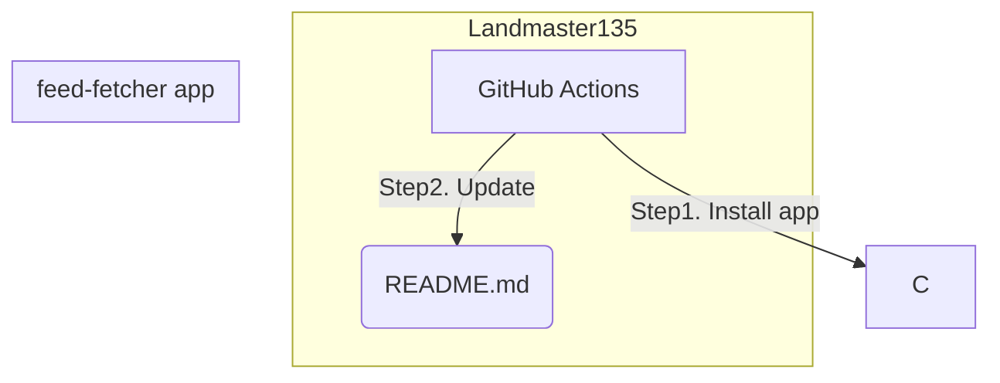

```mermaid
graph TD;
    subgraph Landmaster135;
        A[GitHub Actions]
        B(README.md)
    end
    subgraph feed-fetcher app;
    end
    A -->|Step2. Update| B
    A -->|Step1. Install app| C
```
