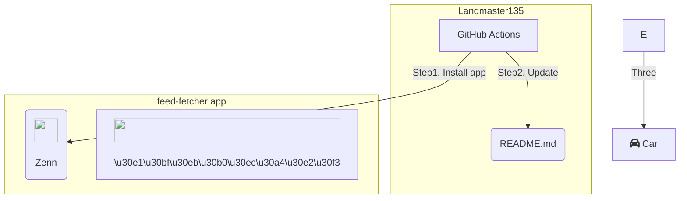

```mermaid
graph TD;
    subgraph Landmaster135;
        A[GitHub Actions]
        B(README.md)
    end
    subgraph feed-fetcher app;
        C(<img src='img/zenn.png' width='40' height='40' /><br>Zenn)
        D[<img src='https://digimon.net/cimages/digimon/metalgreymon-v.jpg' width='40' height='40' /><br>\u30e1\u30bf\u30eb\u30b0\u30ec\u30a4\u30e2\u30f3]
    end
    A -->|Step2. Update| B
    A -->|Step1. Install app| C
    E -->|Three| F[fa:fa-car Car]
```
